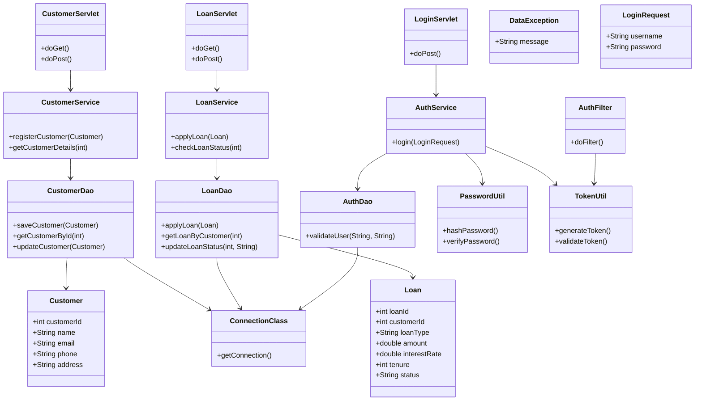

```mermaid
classDiagram
class CustomerServlet {
    +doGet()
    +doPost()
}

class LoanServlet {
    +doGet()
    +doPost()
}

class LoginServlet {
    +doPost()
}

class CustomerService {
    +registerCustomer(Customer)
    +getCustomerDetails(int)
}

class LoanService {
    +applyLoan(Loan)
    +checkLoanStatus(int)
}

class AuthService {
    +login(LoginRequest)
}

class CustomerDao {
    +saveCustomer(Customer)
    +getCustomerById(int)
    +updateCustomer(Customer)
}

class LoanDao {
    +applyLoan(Loan)
    +getLoanByCustomer(int)
    +updateLoanStatus(int, String)
}

class AuthDao {
    +validateUser(String, String)
}

class PasswordUtil {
    +hashPassword()
    +verifyPassword()
}

class TokenUtil {
    +generateToken()
    +validateToken()
}

class ConnectionClass {
    +getConnection()
}

class AuthFilter {
    +doFilter()
}

class DataException {
    +String message
}
class Customer {
    +int customerId
    +String name
    +String email
    +String phone
    +String address
}

class Loan {
    +int loanId
    +int customerId
    +String loanType
    +double amount
    +double interestRate
    +int tenure
    +String status
}

class LoginRequest {
    +String username
    +String password
}

CustomerServlet --> CustomerService
CustomerService --> CustomerDao
CustomerDao --> Customer
CustomerDao --> ConnectionClass

LoanServlet --> LoanService
LoanService --> LoanDao
LoanDao --> Loan
LoanDao --> ConnectionClass

LoginServlet --> AuthService
AuthService --> AuthDao
AuthService --> PasswordUtil
AuthService --> TokenUtil
AuthDao --> ConnectionClass

AuthFilter --> TokenUtil
```
