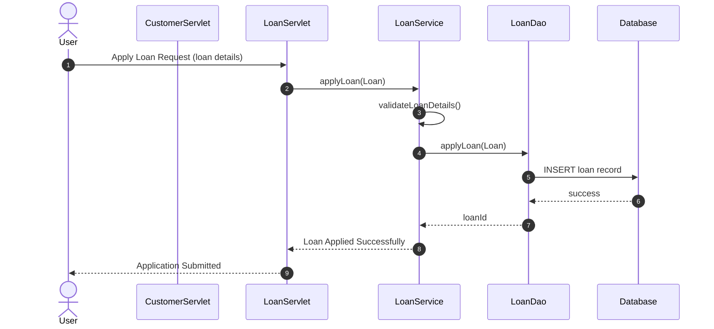

```mermaid
sequenceDiagram
    autonumber

    actor User
    participant CustomerServlet
    participant LoanServlet
    participant LoanService
    participant LoanDao
    participant DB as Database

    %% Customer applies for loan
    User ->> LoanServlet: Apply Loan Request (loan details)
    LoanServlet ->> LoanService: applyLoan(Loan)

    %% Business validation
    LoanService ->> LoanService: validateLoanDetails()

    %% Persist loan
    LoanService ->> LoanDao: applyLoan(Loan)
    LoanDao ->> DB: INSERT loan record
    DB -->> LoanDao: success
    LoanDao -->> LoanService: loanId

    %% Response back
    LoanService -->> LoanServlet: Loan Applied Successfully
    LoanServlet -->> User: Application Submitted
```
