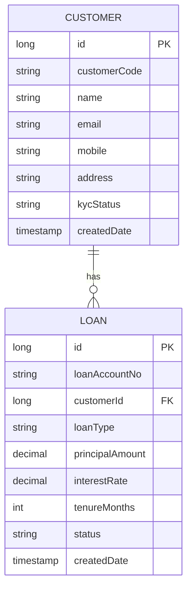

```mermaid
erDiagram
    CUSTOMER ||--o{ LOAN : has

    CUSTOMER {
        long id PK
        string customerCode
        string name
        string email
        string mobile
        string address
        string kycStatus
        timestamp createdDate
    }

    LOAN {
        long id PK
        string loanAccountNo
        long customerId FK
        string loanType
        decimal principalAmount
        decimal interestRate
        int tenureMonths
        string status
        timestamp createdDate
    }
```
